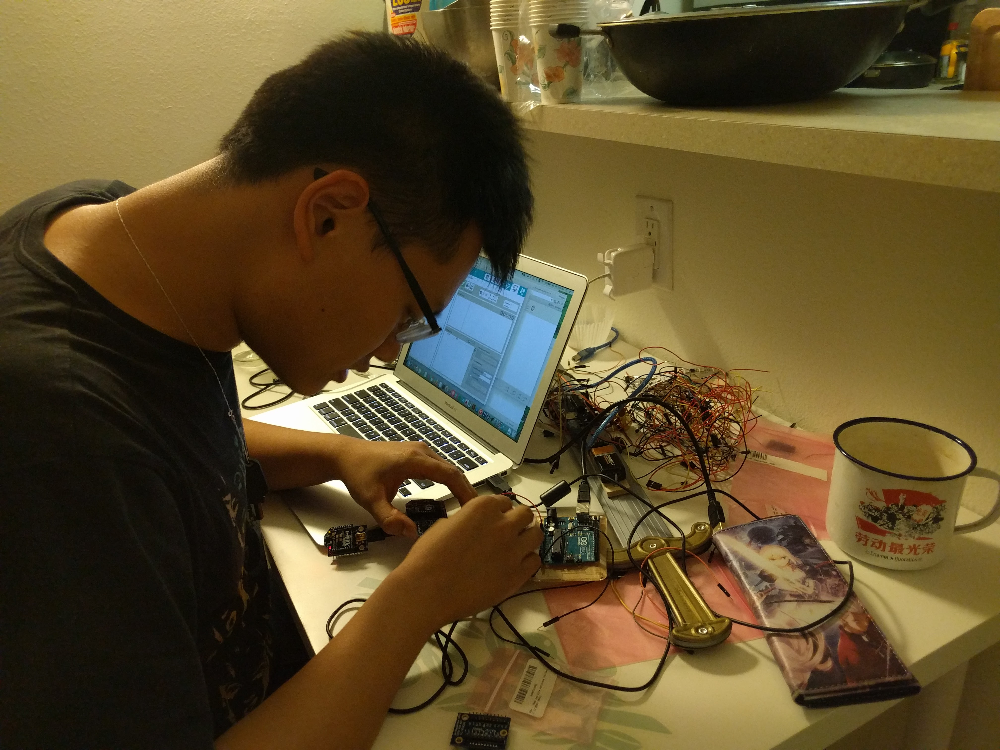

Thank you for coming to this website. Usually this site should be just used by myself but if you come, feel free to have a look.
As for my portfolio, please check [itpzhufy.com](http://itpzhufy.com)

* My personal bio:
  * 2018.09 - Ph.D. Candidates in DGP, University of Toronto. Advised by [Tovi Grossman](http://tovigrossman.com/)
  * 2018.06 - 2018.09 VR HCI researcher in Nvidia Research
  * 2017.01 - 2018.05 Head of Research Group, co-founder of Holojam Inc
  * 2016.09 - 2018.05 Research Scientists in Future Reality Lab, NYU, Advised by [Ken Perlin](http://mrl.nyu.edu/~perlin/)
  * 2015.06 - 2017.05 Master Candidate in Interactive Telecommuncations Program, NYU
  * 2014.04 - 2015.06 Research Intern in x-studio, Tsinghua University. [link](http://www.x-studio.org.cn/)
  * 2011.09 - 2015.06 Undergrade Candidate in School of Physics, Peking University
  * 2012.09 - 2015.06 Undergrade Candidate in School of Arts, Peking University, as a second major
